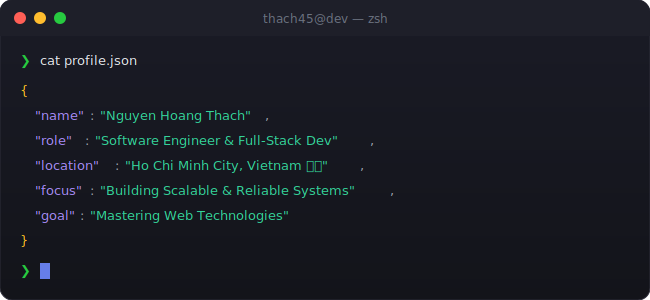

<!-- 
╔══════════════════════════════════════════════════════════════════════════════╗
║                                                                              ║
║   ██████╗ ███████╗██████╗  ██████╗ ██╗   ██╗ █████╗ ███╗   ██╗██╗   ██╗██╗   ║
║   ██╔══██╗██╔════╝██╔══██╗██╔═══██╗╚██╗ ██╔╝██╔══██╗████╗  ██║██║   ██║██║   ║
║   ██████╔╝█████╗  ██║  ██║██║   ██║ ╚████╔╝ ███████║██╔██╗ ██║██║   ██║██║   ║
║   ██╔══██╗██╔══╝  ██║  ██║██║   ██║  ╚██╔╝  ██╔══██║██║╚██╗██║██║   ██║██║   ║
║   ██║  ██║███████╗██████╔╝╚██████╔╝   ██║   ██║  ██║██║ ╚████║╚██████╔╝███████╗
║   ╚═╝  ╚═╝╚══════╝╚═════╝  ╚═════╝    ╚═╝   ╚═╝  ╚═╝╚═╝  ╚═══╝ ╚═════╝ ╚══════╝
║                                                                              ║
║           🚀 SOFTWARE ENGINEER • FULL-STACK DEVELOPER 🚀                     ║
║                                                                              ║
╚══════════════════════════════════════════════════════════════════════════════╝
-->

<div align="center">
  
  <!-- ═══════════════════════════════════════════════════════════════════════════ -->
  <!-- 🎯 ANIMATED HEADER                                                          -->
  <!-- ═══════════════════════════════════════════════════════════════════════════ -->
  
  
  
  <br/>
  
  <!-- ═══════════════════════════════════════════════════════════════════════════ -->
  <!-- 📊 PROFILE BADGES                                                           -->
  <!-- ═══════════════════════════════════════════════════════════════════════════ -->
  
  <a href="https://github.com/Thach45">
    
  </a>
  &nbsp;
  <a href="https://github.com/Thach45?tab=repositories">
    
  </a>
  &nbsp;
  <a href="https://github.com/Thach45?tab=followers">
    
  </a>
  &nbsp;
  <a href="https://github.com/Thach45">
    
  </a>
  
</div>

<br/>

<!-- ═══════════════════════════════════════════════════════════════════════════ -->
<!-- 🖥️ TERMINAL INTRO SECTION                                                   -->
<!-- ═══════════════════════════════════════════════════════════════════════════ -->

<div align="center">
  
</div>

<br/>


<br/>

<!-- ═══════════════════════════════════════════════════════════════════════════ -->
<!-- 👤 ABOUT ME SECTION                                                          -->
<!-- ═══════════════════════════════════════════════════════════════════════════ -->


<br/><br/>

<table>
<tr>
<td width="55%" valign="top">

### 🎯 What I Do

```yaml
name: Nguyen Hoang Thach
located_in: Ho Chi Minh City, Vietnam 🇻🇳
current_status: Software Engineer & IT Student

areas_of_expertise:
  - 🌐 Full-Stack Web Development
  - 🤖 AI-powered Systems & LLM Integrations
  - ⚡ Real-time Communication (WebSocket, SSE)
  - 🚀 Reliable & Scalable Architecture

currently_building:
  - AI Interview Platform
  - E-Learning Platform

life_philosophy: "Passionate about building reliable and scalable software."
```

</td>
<td width="45%" valign="top">

### 🚀 Current Focus

- 💻 **Developing** robust web applications
- 🤖 **Building** LLM-based features & AI integration
- ⚡ **Optimizing** real-time asynchronous systems
- 🌟 **Learning** new cloud and scalable technologies


<br/>

### 💡 Quick Facts

- 🎓 IT Student at HCMUTE (GPA 3.5/4.0)
- 🔥 Passionate about system architecture
- 🌱 TypeScript, React & Node.js enthusiast
- ☕ Fueled by code & coffee

</td>
</tr>
</table>

<br/>


<br/>

<!-- ═══════════════════════════════════════════════════════════════════════════ -->
<!-- 🏆 ACHIEVEMENTS SECTION                                                     -->
<!-- ═══════════════════════════════════════════════════════════════════════════ -->


<br/><br/>

<div align="center">
  
  <!-- GitHub Trophies -->
  <a href="https://github.com/ryo-ma/github-profile-trophy">
    
  </a>
  
</div>

<br/>


<br/>

<!-- ═══════════════════════════════════════════════════════════════════════════ -->
<!-- 📊 GITHUB ANALYTICS                                                         -->
<!-- ═══════════════════════════════════════════════════════════════════════════ -->


<br/><br/>

<div align="center">
  
  <!-- GitHub Stats + Custom Streak in ONE ROW -->
  <a href="https://github.com/Thach45">
    
  </a>
  &nbsp;
  <a href="https://github.com/Thach45">
    
  </a>
  
  <br/><br/>
  
  <!-- 📊 REAL-TIME LANGUAGE USAGE WITH PROGRESS BARS -->
  <a href="https://github.com/Thach45">
    
  </a>
  
  <br/><br/>
  
  <!-- Activity Graph -->
  <a href="https://github.com/Thach45">
    
  </a>
  
</div>

<br/>


<br/>

<!-- ═══════════════════════════════════════════════════════════════════════════ -->
<!-- ⚡ TECH STACK                                                               -->
<!-- ═══════════════════════════════════════════════════════════════════════════ -->


<br/><br/>

<div align="center">

<!-- 💻 LANGUAGES -->
<h4>💻 Languages</h4>
<p>
  <a href="https://www.typescriptlang.org/" target="_blank"></a>
  <a href="https://developer.mozilla.org/en-US/docs/Web/JavaScript" target="_blank"></a>
  <a href="https://www.java.com/" target="_blank"></a>
  <a href="https://www.python.org/" target="_blank"></a>
</p>

<!-- 🌐 FRONTEND TECHNOLOGIES -->
<h4>🌐 Frontend Technologies</h4>
<p>
  <a href="https://reactjs.org/" target="_blank"></a>
  <a href="https://tailwindcss.com/" target="_blank"></a>
  <a href="https://developer.mozilla.org/en-US/docs/Web/HTML" target="_blank"></a>
  <a href="https://developer.mozilla.org/en-US/docs/Web/CSS" target="_blank"></a>
</p>

<!-- ⚙️ BACKEND FRAMEWORKS -->
<h4>⚙️ Backend Frameworks</h4>
<p>
  <a href="https://nodejs.org/" target="_blank"></a>
  <a href="https://nestjs.com/" target="_blank"></a>
  <a href="https://expressjs.com/" target="_blank"></a>
  <a href="https://spring.io/projects/spring-boot" target="_blank"></a>
</p>

<!-- 🗄️ DATABASES -->
<h4>🗄️ Databases</h4>
<p>
  <a href="https://www.postgresql.org/" target="_blank"></a>
  <a href="https://www.mongodb.com/" target="_blank"></a>
  <a href="https://www.mysql.com/" target="_blank"></a>
  <a href="https://redis.io/" target="_blank"></a>
</p>

<!-- 🔧 TOOLS & PLATFORMS -->
<h4>🔧 Tools & Platforms</h4>
<p>
  <a href="https://git-scm.com/" target="_blank"></a>
  <a href="https://www.docker.com/" target="_blank"></a>
</p>

</div>

<br/>


<br/>

<!-- ═══════════════════════════════════════════════════════════════════════════ -->
<!-- 🔥 CURRENTLY WORKING ON                                                     -->
<!-- ═══════════════════════════════════════════════════════════════════════════ -->

<div align="center">
  
### ⚡ Currently Building

<br/>

<a href="https://github.com/Thach45">
  
</a>
&nbsp;
<a href="https://github.com/Thach45">
  
</a>

</div>

<br/>


<br/>

<!-- ═══════════════════════════════════════════════════════════════════════════ -->
<!-- 🌐 CONNECT WITH ME                                                          -->
<!-- ═══════════════════════════════════════════════════════════════════════════ -->


<br/><br/>

<div align="center">
  
<a href="https://github.com/Thach45" target="_blank">
  
</a>
&nbsp;
<a href="https://hoangthach.me" target="_blank">
  
</a>
&nbsp;
<a href="mailto:hoangthach.dev@gmail.com">
  
</a>

</div>

<br/>


<br/>

<!-- ═══════════════════════════════════════════════════════════════════════════ -->
<!-- 🌟 FOOTER                                                                   -->
<!-- ═══════════════════════════════════════════════════════════════════════════ -->

<div align="center">
  
  
  
  <br/><br/>
  
  
  
</div>
